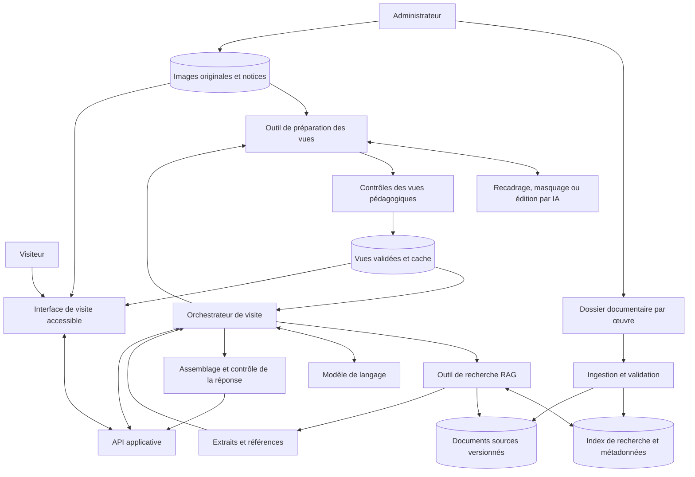
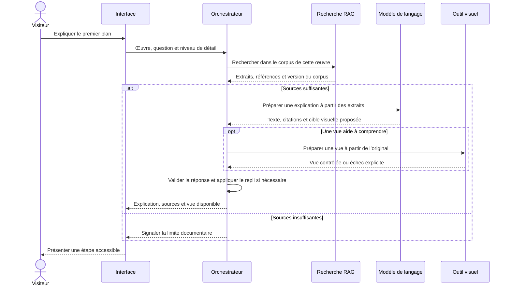

# My-art — Musée interactif accessible

My-art est un projet de musée interactif qui utilise l’intelligence artificielle pour rendre les œuvres d’art plus faciles à comprendre. Le visiteur découvre une œuvre à travers des explications simples, des sources identifiables et des vues pédagogiques qui l’aident à observer les détails décrits.

Le premier **POC (preuve de concept)** porte sur **2 à 3 œuvres**. Il associe une base documentaire fournie par un administrateur, un système de recherche documentaire RAG et un orchestrateur capable de demander les images utiles au fil de l’explication.

> **État du projet : premier POC documentaire Bedrock.** Une interface locale et une CLI permettent de préparer des visites et de poser des questions à Nova à partir des documents d’une œuvre, avec image facultative et contrôle des citations. Le contexte est fourni directement, sans embeddings. La génération d’images OpenAI reste un test indépendant. L’architecture complète décrite plus bas est la cible à terme.

## Démarrer le musée avec Bedrock

**Het Steen est disponible avec ses deux textes et deux vues pédagogiques préparées.** Le [guide Het Steen](docs/het-steen-poc.md) décrit l'import et les appels de génération d'images simulés, sans service externe :

```powershell
.\.venv\Scripts\python.exe -m my_art import-artwork "art_gallery\het steen"
```

Le [guide Bedrock](docs/bedrock-poc.md) décrit la configuration AWS, le dossier administrateur et les tests. Aucune clé OpenAI n’est nécessaire pour ce parcours.

```powershell
py -m venv .venv
.\.venv\Scripts\python.exe -m pip install -r requirements-bedrock.txt
.\.venv\Scripts\python.exe -m my_art init-demo
.\.venv\Scripts\python.exe -m streamlit run app.py --server.address 127.0.0.1 --browser.gatherUsageStats false
```

Si `.venv` existe déjà, sautez la première commande. `init-demo` ajoute deux œuvres **fictives** dans un dossier de données vide et refuse d’écraser un catalogue existant. L’aperçu du contexte est gratuit et fonctionne sans identifiants ; demander une explication déclenche au maximum un appel Bedrock facturable. Les références et citations sont contrôlées, mais la justesse des explications reste à vérifier humainement.

## Tester la génération d’images

Le script [generate_views.py](generate_views.py) prend une image du tableau et demande des vues du premier plan, de l’arrière-plan visible et d’un détail. Chaque vue repart de l’original. Un mode `--dry-run` prépare les consignes sans appel API.

Consultez le [guide de démarrage Python](docs/image-generation-test.md) pour installer les dépendances, créer votre clé API, configurer `.env` et lancer le test. **L’API est facturée séparément de ChatGPT Plus.** Les résultats nécessitent une vérification visuelle avant utilisation dans le musée.

## 1. Vision et objectifs

L’objectif est de permettre au plus grand nombre de comprendre une œuvre, sans connaissances préalables en histoire de l’art.

- **Expliquer simplement** : utiliser des phrases courtes, définir les termes spécialisés et proposer plusieurs niveaux de détail.
- **Ancrer les explications dans des sources** : retrouver les informations dans une documentation sélectionnée par un administrateur.
- **Guider le regard** : montrer le premier plan, l’arrière-plan ou un détail au moment où il est expliqué.
- **Adapter la visite** : permettre au visiteur d’approfondir, de reformuler ou de poser une question.
- **Favoriser l’accessibilité** : rendre le parcours utilisable au clavier, avec un lecteur d’écran et sans dépendre uniquement de la couleur ou des images.

## 2. Périmètre du POC

| Inclus dans le POC | Envisagé après le POC |
| --- | --- |
| Catalogue de 2 à 3 œuvres choisies à l’avance | Extension du catalogue |
| Image de référence et identifiant pour chaque œuvre | Reconnaissance d’une œuvre à partir d’une photo du visiteur |
| Documentation déposée dans un dossier dédié par un administrateur | Interface complète de gestion documentaire |
| Ingestion documentaire déclenchée explicitement | Synchronisation automatique des documents |
| Explications en français, simples ou détaillées | Parcours multilingues |
| Questions-réponses fondées sur les documents | Personnalisation avancée des parcours |
| Vues pédagogiques demandées par l’orchestrateur | Expériences immersives et autres médias |
| Alternatives textuelles et navigation accessible | Narration audio et interaction vocale |

**Hypothèse de départ :** « prendre le tableau en entrée » signifie fournir au système une image de référence associée à une œuvre connue. La reconnaissance automatique d’un tableau photographié n’est pas nécessaire pour valider ce premier POC.

## 3. Parcours utilisateur

1. Le visiteur choisit une œuvre dans le catalogue.
2. L’interface affiche l’image originale, son titre et une première explication courte.
3. Le visiteur lance la visite guidée ou pose une question.
4. L’orchestrateur recherche les passages documentaires utiles et prépare une explication sourcée.
5. Il décide si une vue pédagogique aide à comprendre cette étape : détail agrandi, premier plan isolé, arrière-plan mis en évidence, etc.
6. Le système prépare la vue et vérifie qu’elle correspond à la demande. Si elle n’est pas exploitable, l’explication reste disponible avec l’original.
7. Le visiteur consulte les sources, revient à l’œuvre originale ou demande une reformulation.

### Exemple de séquence pédagogique

Pour une œuvre dont la documentation décrit un personnage au premier plan et un paysage en arrière-plan :

- **Vue d’ensemble** : présenter le sujet et le contexte documenté.
- **Premier plan** : mettre en évidence le personnage et expliquer son rôle selon les sources.
- **Arrière-plan** : attirer l’attention sur les parties visibles du paysage et expliquer leur place dans la composition.
- **Retour à l’ensemble** : relier les éléments observés à la lecture globale de l’œuvre.

Il s’agit d’un exemple de parcours, pas d’une analyse d’une œuvre réelle. Chaque explication effective doit être étayée par le corpus de l’œuvre concernée.

## 4. Architecture proposée

### Vue d’ensemble



### Responsabilités des composants

| Composant | Responsabilité |
| --- | --- |
| Interface visiteur | Afficher l’original, les explications, les vues pédagogiques, leurs alternatives textuelles et les sources. |
| API applicative | Valider les demandes, gérer les sessions et exposer les œuvres et les étapes de visite. |
| Orchestrateur | Planifier une étape, appeler les outils nécessaires et choisir un repli si un outil échoue. |
| Ingestion documentaire | Extraire le contenu, le découper, conserver sa provenance et alimenter l’index. |
| Recherche RAG | Retrouver les passages pertinents en filtrant sur l’œuvre et la version du corpus. |
| Modèle de langage | Reformuler les informations récupérées selon le niveau d’explication demandé. |
| Outil visuel | Produire une vue à partir de l’image originale et d’une cible précisément définie. |
| Contrôles de sortie | Vérifier les références, le format de réponse, l’adéquation des vues et la présence des alternatives textuelles. |
| Stockage et cache | Conserver les originaux, documents, références et vues réutilisables avec leurs versions. |

Pour ce POC, ces responsabilités peuvent être regroupées dans **une application backend et un processus de traitement en arrière-plan**. Le schéma représente des composants logiques et n’impose pas un service indépendant pour chacun. Le choix des langages, modèles, fournisseurs et bases de données reste à valider.

### Déroulement d’une demande



## 5. RAG : utiliser la documentation de référence

Le **RAG (Retrieval-Augmented Generation)** consiste à rechercher des passages dans un corpus avant de demander au modèle de produire une réponse. Ici, le corpus est fourni et relu par un administrateur.

**Le RAG réduit le risque d’invention, mais ne garantit pas à lui seul l’exactitude.** La fiabilité dépend de la qualité des documents, de la recherche, du respect des sources par le modèle et de la validation des réponses.

### Organisation documentaire proposée

```text
data/
├── artworks/
│   ├── oeuvre-001/
│   │   ├── original.jpg
│   │   └── metadata.json
│   └── oeuvre-002/
│       ├── original.jpg
│       └── metadata.json
├── documents/                  # Dossier alimenté par l’administrateur
│   ├── oeuvre-001/
│   │   ├── notice.md
│   │   └── dossier.pdf
│   └── oeuvre-002/
│       └── notice.md
└── generated/                  # Vues dérivées, séparées des originaux
```

Les identifiants sont des exemples. Chaque notice d’œuvre doit préciser au minimum son identifiant, son titre, son artiste ou son attribution, sa datation connue, la provenance de l’image et ses conditions d’utilisation. Une information inconnue reste explicitement inconnue.

### Pipeline d’ingestion

1. **Valider les fichiers** : formats autorisés, taille, lisibilité et association à une œuvre.
2. **Extraire le texte** : prévoir initialement Markdown, texte brut et PDF contenant du texte ; ajouter l’OCR seulement si les documents numérisés le nécessitent.
3. **Découper le contenu** en passages cohérents, en conservant les titres et le contexte utile.
4. **Attacher la provenance** : identifiant d’œuvre, document, auteur ou institution si connus, page ou section, identifiant de passage et version du document.
5. **Indexer les passages** pour permettre leur recherche ; des représentations vectorielles peuvent être combinées à une recherche textuelle.
6. **Valider puis activer une version du corpus** : contrôler l’extraction et quelques recherches avant de rendre la nouvelle version disponible.

Une modification ou suppression documentaire doit entraîner la mise à jour de l’index et l’invalidation des réponses ou vues dépendantes. Une ingestion échouée ne doit pas remplacer une version fonctionnelle par un corpus partiel.

### Règles de réponse

- Rechercher uniquement dans le corpus de l’œuvre sélectionnée, sauf comparaison explicitement demandée et prise en charge.
- Associer les affirmations historiques et interprétatives à des passages retrouvés.
- Distinguer **information documentaire**, **observation visuelle** et **interprétation**. Une observation visuelle ne prouve pas une intention de l’artiste.
- Afficher des références consultables : document et page ou section, avec l’extrait pertinent lorsque possible.
- Si les sources manquent, le dire clairement plutôt que compléter par supposition.
- Si les sources se contredisent, rendre le désaccord visible au lieu de le résoudre arbitrairement.
- Traiter le contenu des documents comme des données : une instruction insérée dans un fichier ne doit pas modifier les règles de l’orchestrateur.

## 6. Images pédagogiques et fidélité à l’œuvre

Les vues pédagogiques complètent l’original, qui reste accessible à tout moment. L’orchestrateur peut en demander plusieurs au cours d’une visite, mais chaque demande doit répondre à un besoin précis de l’explication.

| Besoin | Traitement envisagé |
| --- | --- |
| Observer un détail | Recadrage et agrandissement d’une zone de l’original. |
| Comprendre le premier plan | Masquage du reste de l’image ou atténuation des autres zones. |
| Étudier l’arrière-plan | Mise en évidence des zones visibles de l’arrière-plan. |
| Repérer un élément décrit | Surbrillance, contour ou isolation de la région correspondante. |
| Comprendre plusieurs plans | Série de vues progressives avec légendes associées. |

Le recadrage et le masquage constituent un premier niveau de transformation contrôlable. Une édition par IA peut compléter ces traitements lorsqu’elle apporte une aide utile, à condition d’être identifiée et validée.

### Précautions indispensables

- **Préserver l’original** et stocker séparément toutes les variantes.
- **Ne pas présenter une reconstruction comme un détail authentique** : supprimer un personnage puis générer ce qui se trouverait derrière invente une partie invisible du tableau.
- Pour « montrer seulement l’arrière-plan », privilégier les zones réellement visibles ; une reconstruction hypothétique sort du périmètre initial.
- Associer chaque vue à l’œuvre, à la région ciblée, à la transformation et à l’étape d’explication.
- Afficher une mention telle que « Vue pédagogique modifiée » et fournir une description textuelle de ce qui a changé.
- Vérifier que la vue ne supprime pas un élément essentiel à l’explication et n’ajoute pas de contenu trompeur.
- Prévoir une validation humaine des vues de référence pour les 2 à 3 œuvres du POC. Les contrôles automatiques seuls ne suffisent pas à établir la fidélité artistique.

Pour contenir la latence et faciliter cette validation, le POC peut préparer un petit ensemble de vues à l’avance. L’orchestrateur sélectionne les vues disponibles et ne demande une nouvelle transformation que si elle est nécessaire ; une vue nouvelle reste en attente de validation avant publication au visiteur.

## 7. Approche agentique

L’orchestrateur gère la progression de la visite. Il choisit les outils utiles selon la question, les sources retrouvées et les vues déjà disponibles. Une approche agentique n’exige pas plusieurs agents autonomes dès le départ : **un orchestrateur doté d’outils spécialisés suffit pour le POC**.

### Outils envisagés

| Outil logique | Entrée principale | Résultat attendu |
| --- | --- | --- |
| `retrieve_context` | Œuvre, question, version du corpus | Passages et références documentaires. |
| `get_artwork` | Identifiant d’œuvre | Notice, original et régions annotées disponibles. |
| `prepare_visual` | Œuvre, région, transformation et objectif | Vue validée existante, demande de traitement ou indisponibilité. |
| `validate_step` | Texte, références et vue éventuelle | Résultat des contrôles et corrections nécessaires. |

Ces noms décrivent des contrats à concevoir ; ils ne correspondent pas encore à des fonctions implémentées.

### Contrat d’une étape de visite

Une étape devrait contenir :

- l’identifiant de l’œuvre et le niveau de détail demandé ;
- le texte pédagogique et ses références documentaires ;
- l’identifiant de la vue, si disponible, et le type de transformation ;
- une alternative textuelle et une légende ;
- un état explicite : prêt, sources insuffisantes, vue en cours de validation ou vue indisponible ;
- la version du corpus et un identifiant de suivi pour diagnostiquer les erreurs.

### Limites d’exécution

- Définir un nombre maximal d’appels d’outils, une durée limite et un budget de génération par demande.
- Autoriser uniquement les outils et transformations prévus par l’application.
- Valider côté serveur les identifiants d’œuvres et de régions, ainsi que les paramètres de transformation.
- Réutiliser les vues validées ; inclure l’original, la région, la transformation et les versions pertinentes dans la clé de cache.
- En cas d’échec visuel, conserver une explication textuelle sourcée avec l’original.
- En cas d’échec documentaire, signaler la limite sans générer d’explication historique non étayée.

## 8. Accessibilité et expérience de visite

L’accessibilité doit être vérifiée dès le POC, avec des personnes aux besoins variés lorsque possible.

- **Compréhension** : phrases courtes, vocabulaire expliqué, une idée principale par étape et niveau de détail réglable.
- **Navigation** : commandes utilisables au clavier, ordre de focus cohérent, focus visible et boutons clairement nommés.
- **Lecture assistée** : structure de page sémantique, alternatives textuelles utiles et annonce accessible des états de chargement.
- **Confort visuel** : texte redimensionnable, contrastes suffisants, absence d’information portée uniquement par la couleur.
- **Rythme** : progression manuelle, possibilité de revenir en arrière, animations évitables et original toujours accessible.
- **Transparence** : distinction lisible entre l’œuvre originale, la vue modifiée et les sources de l’explication.

Une reformulation automatique ne suffit pas à garantir qu’un texte soit compris par tous. Les explications doivent être relues et évaluées auprès d’utilisateurs ; aucune conformité d’accessibilité n’est revendiquée à ce stade.

## 9. Données, droits et exploitation

- Vérifier les droits de diffusion des images, des documents et des extraits avant leur intégration.
- Limiter l’ajout documentaire et la validation des vues au rôle administrateur.
- Séparer les documents internes des extraits autorisés à être montrés au public.
- Ne pas exposer directement le dossier documentaire sur le serveur web ; fournir les références via des accès contrôlés.
- Conserver les clés et secrets côté serveur, hors du dépôt.
- Éviter de collecter des données personnelles inutiles et définir la durée de conservation des questions et journaux.
- Vérifier les conditions de traitement des textes et images avant l’envoi à un fournisseur de modèles externe.
- Journaliser les versions du corpus, les références utilisées, les appels d’outils, la latence et les échecs pour rendre les résultats vérifiables.

## 10. Organisation du dépôt envisagée

```text
My-art/
├── README.md
├── docs/                       # Architecture, décisions et protocole d’évaluation
├── frontend/                   # Interface de visite
├── backend/
│   ├── api/                    # Catalogue et sessions
│   ├── orchestration/          # Déroulement des étapes et appels d’outils
│   ├── rag/                    # Ingestion et recherche documentaire
│   └── visuals/                # Transformations, contrôles et cache
├── data/                       # Structure documentaire décrite plus haut
├── evaluation/                 # Questions de référence et grilles de validation
└── tests/                      # Tests techniques à définir avec l’implémentation
```

Cette arborescence décrit la cible du musée. Le POC actuel est organisé dans `my_art/` (corpus, adaptateur Bedrock, orchestration, CLI), `app.py` (interface Streamlit), `examples/` (corpus fictifs), `evaluation/` et `tests/`. Le script autonome `generate_views.py` reste séparé. Les données administrateur dans `data/` et les résultats dans `output/` sont exclus de Git ; seuls les exemples fictifs sont versionnés.

## 11. Feuille de route

| Étape | Livrable | Condition de passage |
| --- | --- | --- |
| 1. Préparer le corpus | 2 à 3 œuvres, images, notices et sources autorisées | Documentation relue et droits vérifiés. |
| 2. Construire le RAG | Ingestion, recherche et réponses avec références | Questions de référence correctement traitées, y compris les cas sans réponse. |
| 3. Construire la visite textuelle | Catalogue, original et explications simples | Parcours complet utilisable au clavier et premières vérifications avec lecteur d’écran. |
| 4. Préparer les vues | Régions annotées et transformations pédagogiques | Vues de référence relues et reliées à leurs explications. |
| 5. Ajouter l’orchestration | Choix des outils et vues au fil du parcours | Appels bornés, cache et modes de repli vérifiés. |
| 6. Évaluer le POC | Essais utilisateurs et bilan qualité, coût et latence | Limites documentées et décision sur la suite. |

## 12. Évaluation et critères de réussite

Le POC doit démontrer qu’une personne peut mieux comprendre une œuvre grâce à une explication sourcée et à des vues pertinentes.

| Dimension | Vérification proposée |
| --- | --- |
| Qualité documentaire | Constituer 10 à 15 questions par œuvre avec réponses attendues et passages de référence. |
| Fidélité des réponses | Relire les affirmations et vérifier que les citations les étayent réellement. |
| Gestion de l’incertitude | Tester les informations absentes, les sources contradictoires et les questions hors sujet. |
| Isolation des œuvres | Vérifier qu’une réponse sur une œuvre n’utilise pas par erreur le corpus d’une autre. |
| Pertinence visuelle | Vérifier la région ciblée, la fidélité à l’original et l’accord entre texte et image. |
| Compréhension | Observer si les visiteurs peuvent reformuler les idées principales après la visite. |
| Accessibilité | Tester clavier, lecteur d’écran, zoom et compréhension des légendes et commandes. |
| Robustesse | Simuler une recherche vide, une génération échouée et un service indisponible. |
| Performance et coût | Mesurer séparément le délai du texte, celui des images et le coût moyen d’une visite. |

Les seuils chiffrés de latence, de coût et de qualité devront être fixés avant l’évaluation finale. A minima, la démonstration doit permettre un parcours complet sur les œuvres retenues, afficher des sources vérifiables et rester utilisable lorsqu’une vue ne peut pas être produite.

## 13. Décisions à prendre avant l’implémentation

1. Quelles œuvres, images de référence et sources constituent le corpus initial ?
2. Quels publics prioritaires permettront de tester la simplicité et l’accessibilité ?
3. Qui valide les interprétations, les textes et les vues pédagogiques ?
4. Quels formats documentaires sont réellement nécessaires au POC ?
5. Les premiers parcours utilisent-ils uniquement des vues préparées, ou aussi des demandes de vues nouvelles soumises à validation ?
6. Quels modèles et environnement d’hébergement respectent le budget et les contraintes de traitement des données ?
7. Quels objectifs de délai, de coût par visite et de conservation des données sont acceptables ?
