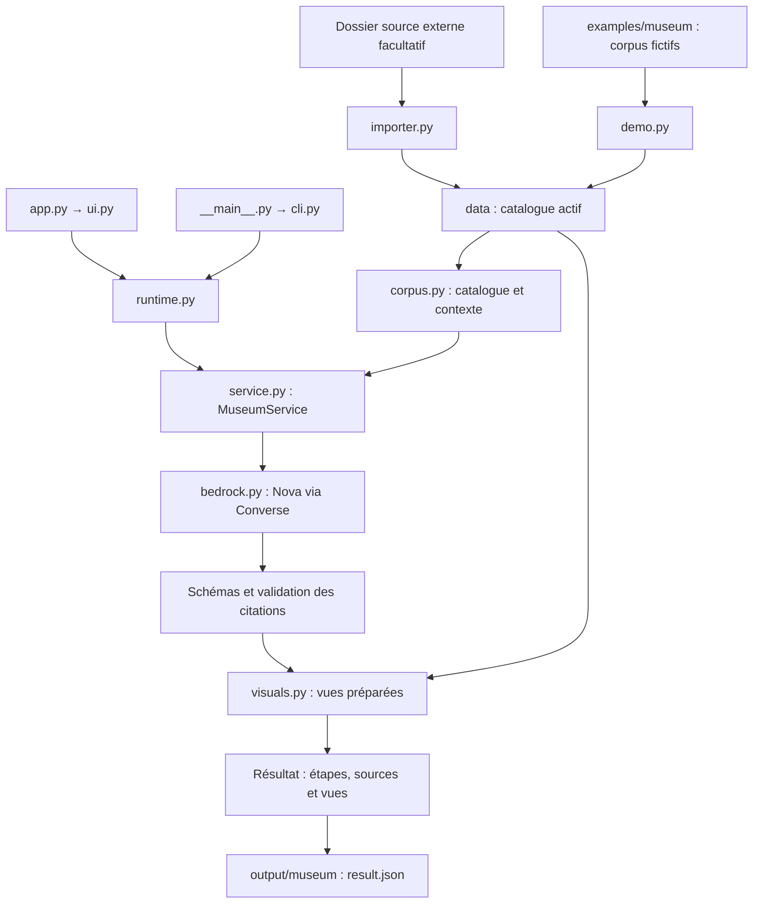
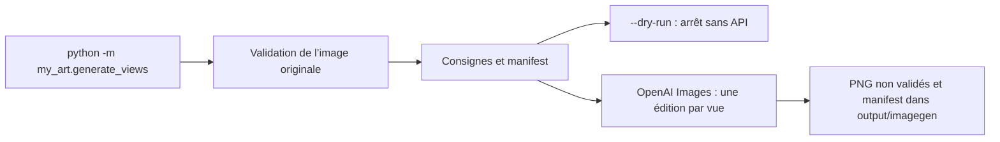

# Architecture actuelle

My-art est une application Python locale. Le code se trouve dans `my_art/`, avec deux entrées pour le musée (Streamlit et CLI) et une entrée indépendante pour l’expérimentation image. L’exécution se fait depuis le dépôt ; aucun paquet installable ni serveur API séparé n’est nécessaire.

## Parcours du musée

`MuseumService.prepare` charge la notice, tous les passages du corpus autorisé et éventuellement une copie JPEG réduite de l’original. La question ne filtre pas les passages : `DirectContextProvider` fournit le contexte complet dans les limites configurées, sans index ni embeddings.

`--dry-run` s’arrête à cette préparation. `MuseumService.run` évite l’appel au modèle si aucun passage n’est disponible ; sinon il effectue un appel à `VisitModel.complete`. Le client AWS est créé au premier appel effectif, pas au chargement de l’interface.

Le modèle retourne une proposition structurée via `present_visit`. La validation contrôle le schéma, les identifiants de sources, la présence des citations dans les passages et la disponibilité d’une image pour les observations visuelles. Ensuite seulement, les étapes demandant un plan ou un détail sont transmises à `ImageProvider.generate`.

`MockImageProvider` restitue une vue déclarée dans la notice sans modifier les pixels. Une vue absente ou illisible renvoie `unavailable`. `overview` renvoie le visiteur à l’original et `none` ne déclenche pas de demande. Une vue de plan entier ne représente pas nécessairement le détail précis proposé par le modèle.

## Responsabilités des fichiers

| Module | Responsabilité |
| --- | --- |
| `app.py` | Lanceur conservé pour `streamlit run app.py`. |
| `my_art/__init__.py` | Identité du package ; aucun fournisseur chargé automatiquement. |
| `my_art/__main__.py` | Entrée `python -m my_art`. |
| `my_art/cli.py` | Arguments, commandes et restitution en console. |
| `my_art/ui.py` | Interface Streamlit et état de la session ; fonction `main` explicite. |
| `my_art/runtime.py` | Assemblage du service et enregistrement des résultats partagés par UI et CLI. |
| `my_art/paths.py` | Racine du dépôt, indépendante des SDK. |
| `my_art/config.py` | Configuration du musée et modèles autorisés dans ce POC. |
| `my_art/demo.py` | Installation des exemples fictifs dans un dossier vide. |
| `my_art/importer.py` | Import d’une œuvre et refus des conflits de fichiers. |
| `my_art/discovery.py` | Détection des originaux et vues par nom, et empreinte des fichiers pour l’actualisation. |
| `my_art/corpus.py` | Catalogue, préparation des images, extraction documentaire et provenance. |
| `my_art/schemas.py` | Contrats Pydantic pour notices, vues et réponses du modèle. |
| `my_art/service.py` | Préparation, appel borné, validation et sélection des vues. |
| `my_art/bedrock.py` | Contrat `VisitModel`, adaptateur Converse et erreurs AWS lisibles. |
| `my_art/visuals.py` | Contrat `ImageProvider` et simulation par fichiers locaux. |
| `my_art/generate_views.py` | Édition expérimentale OpenAI, indépendante du musée. |

Le package reste volontairement peu profond : les modules correspondent à des responsabilités existantes. Les dossiers `frontend`, `backend`, `rag` ou `agents` ne sont pas créés en anticipation de fonctions absentes.

## Ressources et résultats

| Dossier | Usage | Versionné |
| --- | --- | --- |
| `examples/museum/` | Catalogue fictif complet servant à `init-demo` et aux tests. | Oui |
| `evaluation/` | Questions et attentes pour la relecture des réponses. | Oui |
| `data/artworks/<id>/` | Notice, original et vues du catalogue actif. | Oui |
| `data/documents/<id>/` | Corpus actif TXT, Markdown ou PDF textuel. | Oui |
| `output/museum/<exécution>/` | Contexte, réponse et traces de la demande. | Non |
| `output/imagegen/<exécution>/` | Copie de l’original, images et manifest du générateur. | Non |

`MUSEUM_DATA_DIR` remplace `data/`. Un chemin relatif dans `.env` est résolu depuis la racine du dépôt ; `--data-dir`, les sources d’import et les chemins d’images passés en ligne de commande sont résolus depuis le dossier courant. Le `.env` et les sorties par défaut restent ancrés à la racine du dépôt.

Les sources portent une empreinte dérivée de l’œuvre, du document, de l’emplacement et du texte. Le contexte possède également une version. Les sorties enregistrent ces références et peuvent contenir les textes sources complets.

## Génération d’images indépendante

Ce module n’implémente pas `ImageProvider` et le musée ne l’importe pas. Le déplacer dans `my_art` ne l’intègre donc pas à la visite. L’installation image seule n’exige pas Boto3, Streamlit ou pypdf ; celle du musée n’exige pas OpenAI. Pydantic reste une dépendance transitive du SDK OpenAI.

## Limites et extensions

Les limites documentaires sont actuellement : 30 fichiers, 10 Mio par document, 50 pages par PDF, 40 000 caractères et 150 passages par œuvre. Les images d’entrée sont limitées à 20 Mio ; celles destinées à Nova sont réduites à 1 600 pixels sur leur plus grand côté. Un dépassement est refusé, sans troncature silencieuse du corpus.

Les appels aux fournisseurs n’ont pas de relance automatique. Les contrôles de citations vérifient leur présence, pas la pertinence de toutes les affirmations. Chaque question est indépendante et il n’existe ni mémoire conversationnelle ni boucle d’agents.

Les contrats `ContextProvider.retrieve`, `VisitModel.complete` et `ImageProvider.generate` sont conservés : ils sont utilisés par le service et permettent respectivement de remplacer le contexte direct, le modèle et les vues simulées. Une future intégration du générateur devra adapter son résultat au contrat visuel et définir la validation, le cache et les limites d’appels. Voir la [feuille de route](roadmap.md).

## Détection des ajouts

`Catalog.get` complète en mémoire les champs image et vues non renseignés à partir des noms de fichiers. Les choix explicites de `metadata.json` restent prioritaires, même si un fichier déclaré manque : la validation signale alors le problème. Une notice absente dans un dossier existant donne un titre dérivé du dossier et un artiste non renseigné ; une notice présente mais invalide reste rejetée.

`discover_images` exclut les vues des candidats à l’original et refuse de départager des candidats de même priorité. Les images retenues passent ensuite par les contrôles habituels de chemin, taille et format avant utilisation. La détection n’écrit aucun fichier et ne certifie pas le contenu d’une vue.

Un fragment Streamlit compare toutes les trois secondes les chemins, tailles et dates de modification de `artworks/` et `documents/`. Il relance l’affichage uniquement si cette empreinte change. Les boutons de génération restent soumis à une action explicite ; la surveillance n’appelle aucun modèle. Les conventions de nommage figurent dans le [README](../README.md#ajout-automatique-dœuvres-et-dimages).
